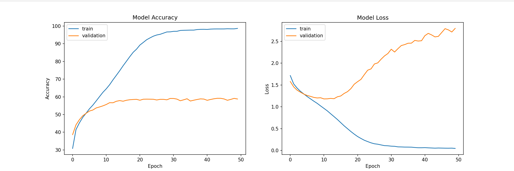

# Emotion detection using deep learning

## Introduction

This project aims to classify the emotion on a person's face into one of **seven categories**, using deep convolutional neural networks. The model is trained on the **FER-2013** dataset which was published on International Conference on Machine Learning (ICML). This dataset consists of 35887 grayscale, 48x48 sized face images with **seven emotions** - angry, disgusted, fearful, happy, neutral, sad and surprised.

## Dependencies

- Python 3, OpenCV, Pytorch
- To install the required packages, run `pip install -r requirements.txt`.

## Basic Usage

- First, clone the repository and enter the folder

```bash
git clone https://github.com/tiwarinikhil/Face-Emotion-Pytorch.git
cd Face-Emotion-Pytorch
```

- Download the FER-2013 dataset.

- If you want to train this model, use:

```bash
python train.py
```

- If you want to view the predictions without training again, you can run:

```bash
cd src
python emotions.py --mode display
```

- The folder structure is of the form:  
  src:

  - data (folder)
  - `train.py` (file)
  - `view.py` (file)
  - `display.py` (file)
  - `haarcascade_frontalface_default.xml` (file)
  - `model.h5` (pre trained weights)

- This implementation by default detects emotions on all faces in the webcam feed. With a simple 4-layer CNN, the test accuracy reached 63.2% in 50 epochs.



## Algorithm

- First, the **haar cascade** method is used to detect faces in each frame of the webcam feed.

- The region of image containing the face is resized to **48x48** and is passed as input to the CNN.

- The network outputs a list of **softmax scores** for the seven classes of emotions.

- The emotion with maximum score is displayed on the screen.

## Future updates

- Live webcam feed emotion detextion
